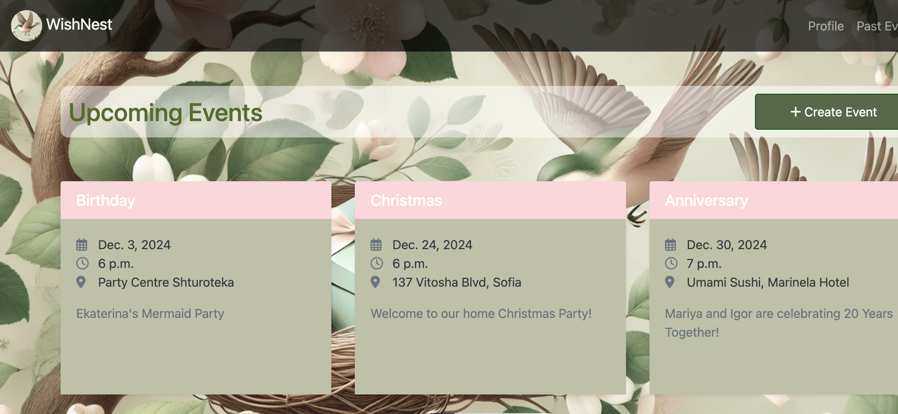
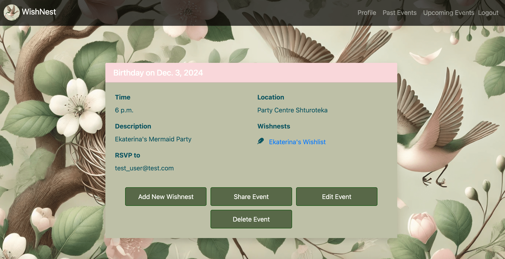
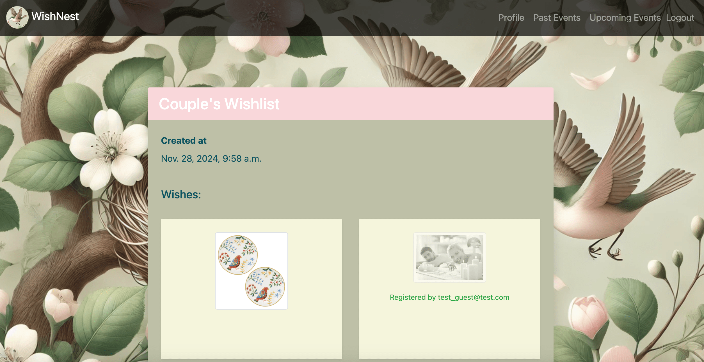

Welcome to WishNest, the ultimate platform for bringing your dreams to life! Whether you're hosting an event, celebrating a milestone, or simply sharing your heartfelt desires, WishNest makes it easy to connect and create unforgettable moments.

🌟 Key Features:

Event Creation: 
Plan and manage events effortlessly. From birthdays to anniversaries, organize every detail with ease.

Share Your Wishes: 
Create a wish list and let your loved ones know what would make your day extra special.

Gift Registry: 
Track and celebrate the thoughtful gifts you receive while ensuring every wish finds its home.

After-Party Love: 
Keep the joy alive by sending virtual hugs and kisses to your guests after the celebration.

At WishNest, we believe in the power of connection and the magic of making wishes come true. Whether you're the host or a guest, there's something here to make every moment unforgettable.

🎉 Join the WishNest today and let your wishes take flight!
_________________________

Assets:

### Home Page
A starting page seen by unauthenticated users.

### Dashboard
The dashboard displays a list of upcoming events.

### Event Details
View event details and add wishnests.

### Wishnest Details
View wishnest details and add your wishes.

### After-Party
Send virtual hugs and kisses to your guests.

_________________________
Testing credentials:

Super User:
test_superuser@test.com
superuser1234

Limited Admin:
admin@test.com
wishnest_admin

Normal User (host of the event):
test_user@test.com
wishnest_1234

Normal User (guest of the event):
test_guest@test.com
wishnest_guest1234

Normal User (guest of the event):
test_guest2@test.com
wishnest_guest12345
__________________________

Project setup

1. Clone the repo

  git clone https://github.com/MariyaKristova/WishNestApp.git

2. Open the project

3. Install dependencies

  pip install -r requirements.txt

4. Change DB settings in settings.py

  DATABASES = {
      "default": {
          "ENGINE": "django.db.backends.postgresql",
          "NAME": "your_db_name",
          "USER": "your_username",
          "PASSWORD": "your_pass",
          "HOST": "127.0.0.1",
          "PORT": "5432",
      }
  }
5. Run the migrations

  python manage.py migrate

6. Run the project

  python manage.py runserver